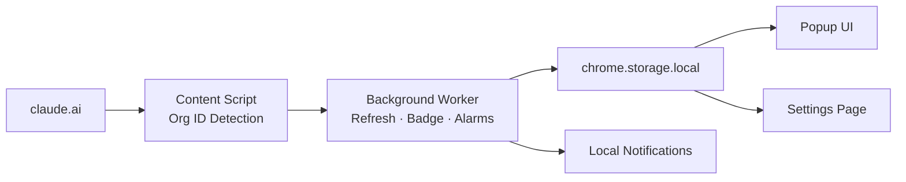

# Architecture

## Runtime components

| Component | File(s) | Role |
|---|---|---|
| Background service worker | `src/background/` | Periodic refresh, alarms, badge, notifications |
| Content script | `src/content/` | Org ID detection on claude.ai pages |
| Popup UI | `src/popup/` | Displays usage state, reset countdown, actions |
| Settings page | `src/settings/` | Controls sync interval, thresholds, privacy options |
| Core utilities | `src/core/` | Normalization, storage, thresholds, countdown formatting |
| Providers | `src/providers/` | Data source abstraction (web API, manual) |
| Shared | `src/shared/` | Constants, error types, formatting helpers |

## Data flow

```
1. User opens claude.ai
2. Content script (interceptor) hooks fetch() to capture org ID from request URLs
3. Org ID is sent to background via postMessage → chrome.runtime.sendMessage
4. Background worker stores org ID in chrome.storage.local
5. Background worker runs on chrome.alarms (default: every 2 minutes)
6. Each alarm cycle:
   a. Load org ID from storage
   b. Fetch https://claude.ai/api/organizations/{orgId}/usage
   c. Normalize response into ClaudeUsageState
   d. Save normalized state to storage
   e. Update toolbar badge
   f. Evaluate notification thresholds
7. Popup reads state from storage when opened
8. Popup refreshes every 30 seconds and on manual trigger
```

## Architecture diagram



## Privacy boundary

The extension reads from `https://claude.ai/api/organizations/{orgId}/usage`. It stores the response (usage percentages, reset timestamps) locally. It does not read, store, or transmit:

- Claude cookies or session tokens
- Prompts or conversation content
- Model responses
- Auth headers

## State model

```ts
type ClaudeUsageState = {
  fiveHour: { utilization: number | null; resetsAt: string | null };
  sevenDay:  { utilization: number | null; resetsAt: string | null };
  extraUsage: { enabled: boolean; utilization: number | null; ... };
  source: 'web-api' | 'page-capture' | 'claude-code' | 'manual';
  lastSyncedAt: string;
  lastStatusCode?: number;
  lastError?: string | null;
};
```

## Build output

```
dist/
├─ manifest.json
├─ popup.html
├─ settings.html
├─ icons/
├─ src/background/index.js
├─ src/content/index.js
├─ src/content/interceptor.js
└─ assets/  (popup and settings JS bundles)
```

Vite builds 4 separate entry points: background worker, two content scripts, popup React app, settings React app.
